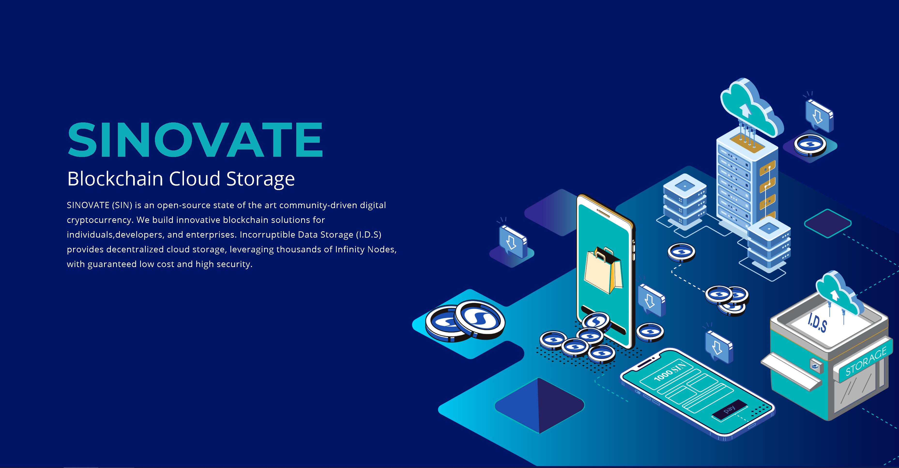

# 

**SINOVATE (SIN)** is an open-source state of the art digital cryptocurrency. We create and build
innovative blockchain services for individuals, developers, and enterprises. Big Data, decentralized cloud,
proof-of-integrity, proof-of-inheritance, and inflation are some of the resolutions presented to the crypto space.

 

# Features and Innovations

 - **X25X** GPU Algorithm. Leading-edge, in-house built,custom GPU mining algorithm. More complex,less power-hungry.
 - **Infinity Nodes** Explicitly designed to overcome the hyperinflation all cryptocurrency projects face. Infinity nodes burn the collateral with unprecedented network security and stability.
 - **Incorruptible Data Storage** Incorruptible Data Storage. DataSend, DataStore and Blockchain-mail. Proof-of-Integrity. Unlimited private networking of big data storage.
 - **FlashSend** Instanteneous trasnactions in less than 2 seconds.
SINOVATE (SIN) combines its brand new **X25X Proof of Work (PoW)** algorithm with LWMA difficulty retargeting algorithm, Reorg fork reject solution merged with P.O.B., establishes a 51% attack protection.

X25X is  GPU mineable and ensures **ASIC, FPGA and QUANTUM resistance**,  solidifying the decentralised consensus mechanism in the process. 

## Coin Specifications

|Specification| Value |
|--|--|
|Block Reward  | **3052.5 SIN** |
|Block Time  | **2 Minutes** |
|Block Dev Fee  | **10%** |
|Difficulty Retargeting Algo | LWMA | 
|Max Transactions Per Second  | **533 tx/s** |
|Total Supply  | **Always Less than 800 million SIN infinitely** |
|Max Block Size  | **16 MB** |
|SINOVATE legacy address start with  | **S** |
|Infinity Node Port  | **20970** |
|<small>BIG</small> Infinity Node Requirement  | **1.000.000 SIN** |
|<small>MID</small> Infinity Node Requirement  | **500.000 SIN** |
|<small>MINI</small> Infinity Node Requirement  | **100.000 SIN** |

