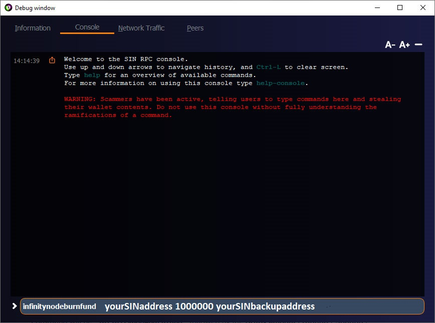

# Infinity Kurulum Klavuzu

!> Lütfen yalnızca Ubuntu **18.04** ile kurulum yapın

## I. KURULUM ÖNCESİ HAZIRLIK

* [x] Sinovate yerel cüzdanını indirip yükleyin. [Official Github channel](https://github.com/SINOVATEblockchain/SIN-core/releases/latest)
* [x] Henüz herhangi bir SIN'iniz yoksa, gerekli Yanma ve / veya Teminat tutarını üzerinde listelediğimiz borsalardan birinden satın alın: [TradeOgre](https://tradeogre.com/exchange/BTC-SIN), [Stex.com](https://app.stex.com/en/basic-trade/pair/BTC/SIN/1D), [Crex24](https://crex24.com/exchange/SIN-BTC), [txbit.io](https://txbit.io/Trade/SIN/BTC/?r=c73), [Coinsbit](https://coinsbit.io/trade/SIN_BTC), [Catex](https://www.catex.io/trading/SIN/ETH).
* [x] Gerekli miktarı yeni kurulan yerel cüzdana gönderin.
* [x] Infinity Nodes oluşturmak için iki işleme ihtiyacınız olacaktır: ** “YANMA” ** ve ** “Teminat“ **.
* [x] Yerel cüzdanda `` Settings, Options, Wallet '' menüsünden `` Enable coin control features '' seçeneğini aktif ederek  Coin Control özelliğini etkinleştirin.
* [x] Infinity Nodes oluşturma sırasında Yedekleme Adresi olarak kullanılacak farklı bir cüzdandan ikincil bir SIN adresi oluşturun.

**Infinity Nodes** üç çeşittir:

| Aşama | Yanma | Teminat |
| :--- | :---: | :---: |
| SIN-MINI | 100,000 SIN | 10,000 SIN |
| SIN-MID | 500,000 SIN | 10,000 SIN |
| SIN-BIG | 1,000,000 SIN | 10,000 SIN |

** Yanma ** tutarı “yakılacak” ve artık alım satım için kullanılamayacak olan paraların toplamını temsil eder.

** Teminat ** \ (10.000 SIN \) cüzdanınızın içinde kilitli kalacaktır. Bu paraların kilidini açmak ve taşımak düğümü devre dışı bırakır.

## II. KURULUMU BAŞLATMA

?> Yerel cüzdanı açtığınızda, ** DAİMA ** tamamen senkronize olmasına izin verin. İlk açtığınızda uzun zaman alacaktır, bu yüzden lütfen sabırlı olun.

### 1. SIN Yedekleme Adresi oluşturma

Daha fazla güvenlik olarak, Infinity Nodes'a yeni bir özellik eklendi: ** Yedekleme Adresi **. Herhangi bir nedenle PC'nizin saldırıya uğraması ve yerel cüzdanınızın güvenliği ihlal edilirse, başka bir cüzdan kaynağından Yedekleme Adresi ile yeni bir Infinity Node oluşturulabilir.
Yeni bir SIN adresi oluşturmak için aşağıdaki adımları izleyin **sadece bu amaçla kullanılmalıdır** ve paranızın güvenliğini en üst düzeye çıkarır.

* Yerel SIN cüzdanınızı açın.
* Cüzdan üst menüsünde, önce `Help` ve ardından `Debug  Window` ve `Console` seçeneklerini tıklayın.
* Aşağıdaki komutu girin:

  ```
  createwallet "SIN_Backup"
  ```

* :warning: **Devam etmeden önce yeni cüzdanı seçtiğinizden emin olun.** Aşağıdaki ekran görüntüsüne bakın:


* Şimdi yeni cüzdanda yeni SIN adresini oluşturun:

  ```
  getnewaddress
  ```

* Oluşturulan SIN adresini seçin ve kopyalayın.
* Şimdi yeni SIN adresiniz için özel anahtarı alın:

  ```
  dumpprivkey YOUR_ADDRESS
  ```

* :warning: :key: _**YENİ SIN ADRESİNİ VE ÖZEL ANAHTARI MUHAFAZA EDİN VE GÜVENLİ BİR ŞEKİLDE SAKLAYIN SADECE ÖZEL ANAHTAR İLE ADRESİN TAM KONTROL EDİLMESİ GEREKİR. ASLA HERHANGİ BİR DURUMDA, ÖZEL ANAHTARINIZI DİĞER BİR KİŞİ İLE PAYLAŞMAYIN.**_ :warning: :key:
* Yeni SIN adresinizi ve özel anahtarı güvenli bir yerde sakladıktan sonra, artık ikinci cüzdanı devreden çıkarabilirsiniz.. Aşağıdaki komutu girin:

  ```
  unloadwallet
  ```


* **ŞİMDİ ÇOK ÖNEMLİ** geçici cüzdan klasörünüz SIN_Backup'ı fiziksel olarak sildiğinizden emin olun. Ayrıca geri dönüşüm kutusunu boşalttığınızdan emin olun.
* Yerel SIN cüzdanınızı kapatın.
* Sabit diskinizde önceden oluşturulan geçici cüzdan klasörünü bulun `SIN_Backup`:
  * Linux: `~/.sin/wallets/`
  * MAC: `~/Library/Application Support/SIN/wallets/`
  * Windows: `%appdata%\SIN\wallets`
    * \(Bu varsayılan olarak Windows XP de `C:\Documents and Settings\KullanıcıAdınız\Application data\SIN\wallets`  ve Windows Vista, 7, 8, ve 10 da `C:\Users\KullanıcıAdınız\Appdata\Roaming\SIN\wallets` klasöründe yer alır.\)
* **SIN\_Backup** dizinini **Silin**


* Geri dönüşüm kutusunu boşaltın.
* Lütfen **sonraki bölümde yeni oluşturulan yedek SIN adresini kullanın** \(Yanma İşlemi\).
  * _Birden fazla Infinity Node oluştururken aynı yedekleme adresini kullanabilirsiniz._

### 2. Yanma İşlemi

Sinovate yerel cüzdanınızı açın ve yeni bir alıcı adresi oluşturun:

* Üst menüde, `File` ve ardından `Receiving Address` e tıklayın
* Adresi etiketleyin \(Örneğin: 01-BIG – ekran görüntüsüne bakın\).


* Yeni oluşturulan adresi kopyalayın.
* Cüzdanın `Send` sekmesine gidin ve adresi `Pay to` alanına yapıştırın.
* `Amount` alanında, Infinity Node oluşturmak istediğiniz ** Yanma ** miktarını girin \(100,000 / 500,000 / 1,000,000\) – aşağıdaki ekran görüntüsüne bakın.
* Miktar tam olmalıdır, ne daha fazla, ne daha az olmamalıdır.


:warning:**ÖNEMLİ:** `Subtract fee from amount` yazan küçük onay kutusunu İŞARETLEMEYİN. Olduğu gibi bırakın.

* ** Transactions ** sekmesini tıklayın ve işlemin ** 2 onay ** almasını bekleyin.
* Onaylar geldikten sonra ** Send ** sekmesine dönün ve ` OPEN COIN CONTROL ` düğmesine tıklayın.
* Miktarlar içeren bir liste açılmalıdır. Yanma miktarını karşılayacak miktarı seçin \(Örneğimizde bu 1.000.000 SIN olurdu\). Solundaki küçük onay kutusunu işaretleyerek seçin ve onaylamak için Tamam düğmesini tıklayın. Bu, bir sonraki işlem olan yanma işleminin yalnızca bu kaynaktan yapılmasını sağlayacaktır.


* Cüzdan üst menüsünde, önce `Help` ve ardından `Debug Window` ve `Console` seçeneklerini tıklayın.
  * Yanma komutunu girmeden önce, cüzdanınız şifrelenmişse cüzdanın kilidini açtığınızdan emin olun. `Debug Console` / penceresini açın ve şu komutu girin: `walletpassphrase şifre 999` \(şifreyi cüzdan şifrenizle değiştirin\). 999, cüzdanınızın kilidinin açık kalacağı saniye sayısıdır, bunu yeterli herhangi bir sayı yapabilirsiniz.
* Aşağıdaki ekran görüntüsünde gösterildiği gibi, hata ayıklama penceresinin alt alanına yazma komutunu girin. Komut `infinitynodeburnfund` olacaktır, ardından **YANMA miktarı \(100000 / 500000 / 1000000\) ve ardından yedek adres gelir.**
* Lütfen daha önce oluşturulan yedek adresi kullanın. \(Bölüm 1. SIN Yedekleme Adresi oluşturma\)
  * _Yerel cüzdanınızın elegeçirilmesi durumunda bu cüzdana para alabilmek için yedek adresin başka bir cüzdandan olması gerekir._
* **Komutun düzgün girildiğinden emin olun, çünkü bu paraları artık kurtaramazsınız.**
* Aşağıdaki ekran görüntüsünde SIN-BIG Infinity Node için bir örneğimiz var, bu durumda komut

  ```
  infinitynodeburnfund 1000000 sizinSINyedekadresiniz
  ```



!> **UNUTMAYIN: BU EKRAN SADECE ÖRNEK AMAÇLIDIR! Bu noktada herhangi bir şüpheniz varsa, bir hatanın sonuçlarını tam olarak anlamadan komutu girmeden önce Sinovate Destek ile iletişime geçmek en iyisidir.**

* YANMA komutunu girdikten sonra, aşağıdaki ekran görüntüsündekine benzer bir çıktı alırsınız.


* İşlem sekmesinden, işlemi çift tıklayarak ** Yanma ** işlem bilgilerini alın. **Transaction ID ve Output Index'ini Not Defteri'ne kopyalayın, daha sonra bu bilgilere ihtiyacınız olacaktır.**


### 3. Teminat işlemi

Madeni paraları ulaşılamaz hale getiren Yanma işleminden farklı olarak, ** Teminat İşlemi ** yerel cüzdanınızın içinde kilitli kalacak, ancak tamamen kontrolünüz altında kalacak olan 10.000 SIN madeni para içerir. **

* Sinovate cüzdanınızdaki `Send` sekmesine gidin ve YANMA işlemi için kullandığınız AYNI ADRES'e tam olarak 10.000 SIN gönderin.
* Transaction sekmesinden, ** Teminat ** işlem bilgisini işleme çift tıklayarak alın. ** Transaction ID ve Output Index'ini Not Defteri'ne kopyalayın, daha sonra bu bilgilere ihtiyacınız olacaktır. **


### 4. Infinity Node PRIVKEY

* Cüzdan üst menüsünde, önce `Help` ve ardından `Debug Window` ve `Console` seçeneklerini tıklayın. Yeni bir masternode privkey oluşturmak için şu komutu yazın: `masternode genkey`. ** Not Defteri'ne bu özel anahtarı kopyalayın, bu bilgiye daha sonra ihtiyacınız olacak. **


### 5. infinitynode.conf dosyasını düzenleme

* Cüzdanın üst menüsünde ` Tools` ve `Open Infinitynode Configuration File` ı tıklayın.
* Yeni bir satıra, sonraki adımlarda gösterildiği gibi infinitynode yapılandırmasının satırını girin, ** daha önce Not Defteri'nde kopyaladığınız tüm gerekli bilgileri elde edin **

**Satır şunlardan oluşur:**

| Alias | VPS IP:PORT | privkey | Collateral tx ID | Collateral Output index | Burn tx ID | Burn Output index |
| :---: | :---: | :---: | :---: | :---: | :---: | :---: |


**Bu yüzden aşağıdaki örnek gibi görünmelidir:**

| Alias | VPS IP:PORT | privkey | Collateral tx ID | Collateral Output index | Burn tx ID | Burn Output index |
| :---: | :---: | :---: | :---: | :---: | :---: | :---: |
| 01-BIG | 78.47.162.140:20970 | 7RRfQkxYPUKkKFAQBpoMde1qaB56EvPU5X8LYWq16e2YtTycvVi | 7f48e48e51b487f0a962d492b03debdd89835bc619242be29e720080fc4b2e09 | 0 | 764fe088b95d287b56f85ee0da11bb08195a862ded8b7ded08a3783135418e3c | 0 |

**infinitynode.conf dosyasının ekran görüntüsü:**


* Dosyayı kaydedin, ardından ** Cüzdanı yeniden başlatın. **

## III. VPS kurulumu

!> :warning: VPS kurulumundan önce lütfen ** Teminat ** ve ** Yanma ** işlemlerinin ** 15 onay ** olduğunu bekleyin.

### A. İlk Aşama

* Windows kullanıcısıysanız, bir SSH istemcisi indirip yükleyin\(Ör. [Bitvise](https://www.bitvise.com), [Putty](https://www.putty.org/), [Xshell](https://www.netsarang.com/en/free-for-home-school/), vb...\)
* VPS'nize bağlanın ve ilk kurulum için yeni şifrenizi girin.
* Ardından aşağıdaki komutları girin:

  ```bash
  wget https://sinovate.io/downloads/sin_install_vps_noroot.sh
  chmod +x sin_install_vps_noroot.sh
  ./sin_install_vps_noroot.sh
  ```

* Komut dosyası, güvenlik nedeniyle ** yeni bir kullanıcı adı ** girmenizi ister.
* Yeni bir kullanıcı adı girmezseniz, varsayılan kullanıcı adı ** sinovate ** olacaktır!
* Yeni kullanıcı adından sonra, ** yeni bir şifre istenecektir ** \(unutmayacağınız güçlü bir şifre seçin\).
* Kurulum birkaç dakika sürecek, lütfen sabırlı olun!


* Sizden **Sinovate Infinitynode Private Key** istenecek .
  * Önceki adımda `4. infinitynode.conf dosyasını düzenleme` bölümünde belirtildiği gibi `infinitynode.conf` dosyanızda bulabilirsiniz.


* Kurulumun ilk aşaması tamamlandı.


* VPS'nizden çıkış yapın.

### B. İkinci Aşama

* SSH istemcinizde bir bağlantı profili oluşturun


> Infinity Node yüklemesi sırasında seçtiğiniz kullanıcı adı veya varsayılan sinovate kullanıcı adı


* Bağlandıktan sonra aşağıdaki komutları yazın:

```bash
# your choosen username during infinity node installation or default sinovate username
su sinovate
bash
```


* Senkronizasyon işlemini gerçek zamanlı olarak görmek için aşağıdaki komutları girin ve ** MASTERNODE\_SYNC\_FINISHED ** durumunu görene kadar bekleyin. Bu işlem 30 dakika kadar sürebilir, lütfen sabırlı olun!

```bash
# CTRL+C to exit
# The following command will indicate the current blockheight, masternode status and sync status
watch -n 5 '~/sin-cli getblockcount && ~/sin-cli masternode status && ~/sin-cli mnsync status'
```


* Infinity Node senkronizasyon durumunuz ** MASTERNODE\_SYNC\_FINISHED ** olduğunda, yerel cüzdanınızı açın.
* Infinity sekmesinin `Settings, Options, Wallet` 'da etkinleştirildiğinden ve `Show InfinityNodes Tab` kutucuğunun işaretlendiğinden emin olun.
* Infinitynodes sekmesine gidin, nodunuzu seçin, ardından ** START ALIAS ** düğmesine tıklayın.
* Infinitiy Node durumu önce **PRE\_ENABLED**, ardından **ENABLED** olarak birkaç dakika sonra değişmelidir. \(genellikle 10-30 dakika\).


* Ancak, tüm masternode soğuk cüzdanları bazen düğümünüzün üzerindeki küçük ** Not ** 'da belirtildiği gibi sizi yeniden başlatmanıza neden olabilecek yanlış durumları gösterebilir\(s\).
* Bu nedenle, VPS'den Infinity Node durumunu da kontrol edebilirsiniz.
* VPS ekranınıza aşağıdaki komutu girin, bu durumu görmelisiniz: **Masternode successfully started**

  ```bash
  ~/sin-cli masternode status
  ```


**TEBRİKLER! INFINITY NODE'UNUZ ÇALIŞIYOR!**

