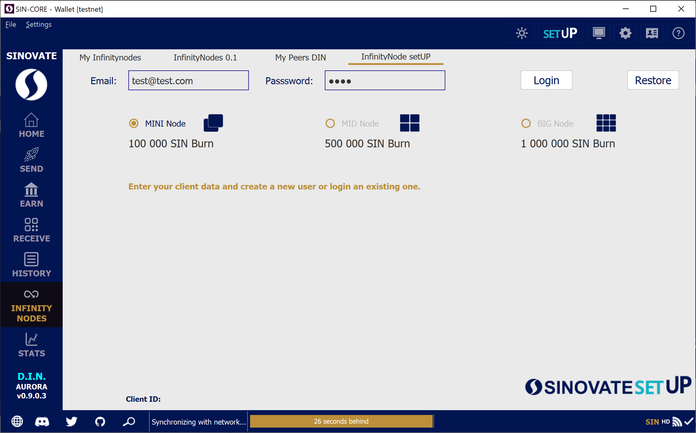
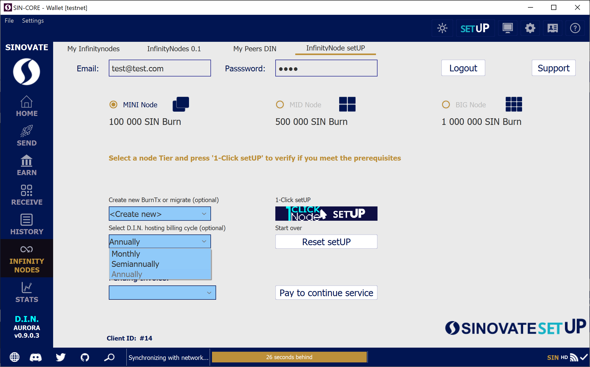
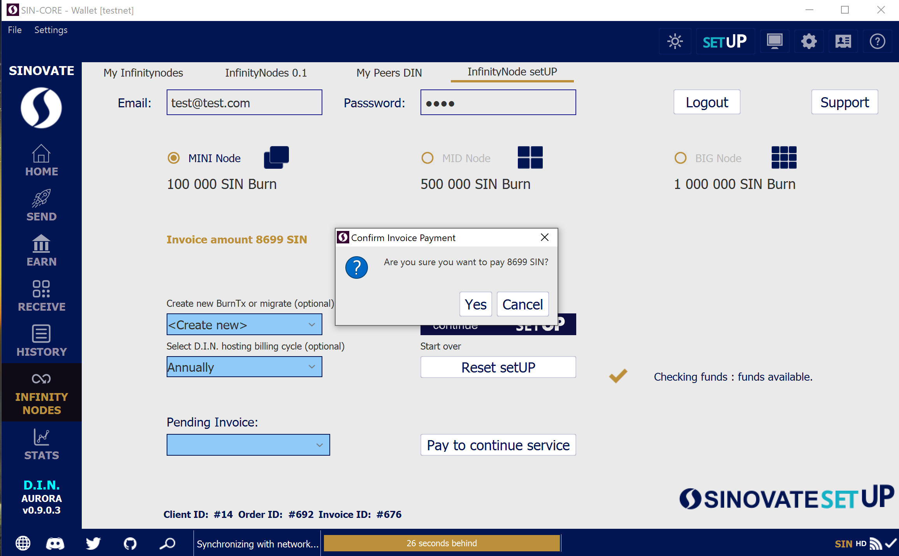
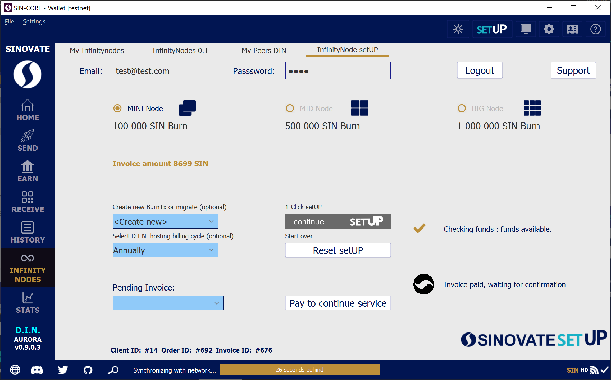
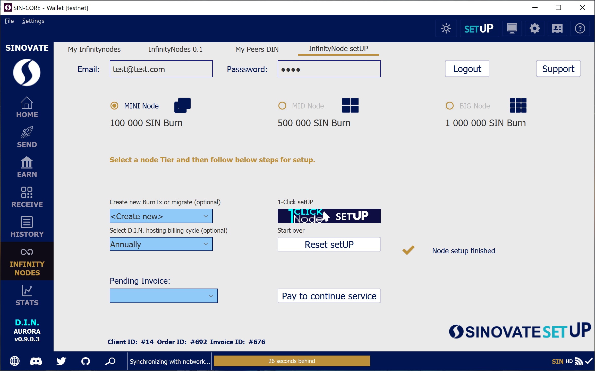

Please follow the below guide in order to set up a Deterministic Infinity Node using the in-wallet SINOVATE setUP:

> **Send all coins to one internal address using coin control**

  

> 1.Upon opening your SINOVATE wallet, click the “setUP” icon on the upper right side.

>

>  2. Enter your Email address and Password for the SINOVATE setUP cold hosting service. Click the “Create/Login” button to create your login credentials.

  

  

>  3. Select the “MINI Node” (100,000 SIN), “MID Node” (500,000 SIN), or “BIG Node” (1,000,000 SIN) circle, according to your desired level of investment. Participants can ensure that they have sufficient funds to set up a node by clicking “Check.”

  

  

>  4. Once determined, select your preferred payment plan from the drop-down menu.

  
  

  

>  5. Click “Place Order”and Confirm your Invoice Payment by clicking “Yes.” Please ensure that you have the required additional SIN coins within your wallet balance to process the VPS (Virtual Private Server) rental fee. Please note that this will vary depending on the payment plan selected.

  
  

  

> SINOVATE setUP is now complete. Depending on block confirmation speed, invoice payment, and the SIN coin burning process will automatically take between 3 and 10 minutes.

  

  

Check the transactions History of your wallet and your node will be up and running in less than 10 mins automatically after the confirmations.

  

It really is that simple. In just a few short clicks, would-be network participants will earn considerable passive income for up to a year. For community members who have previously set up an infinity node, SINOVATE setUP provides the perfect opportunity to reassess your VPS needs at a fraction of the cost.
