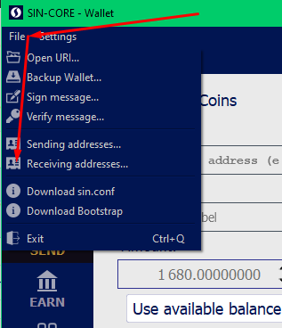
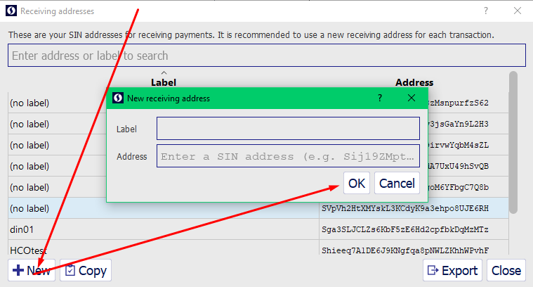
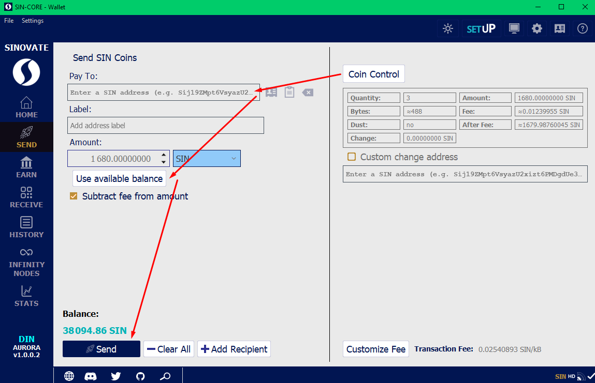

**Transaction too high**

Transaction too high error is regular miners limit error.

For example you try to Burn coins or send all wallet ballance and a lot small transactions hit blockchain limit with error
in that case please use Coin control feature

create new Receiving address

select and copy it with right mouse click

select several addresses from [Coin control](Coincontrolenable) > Coin Selection window

and try to send several times to generated from prev step address

**The goal is to lover address count in the **Coin Selection window.**
