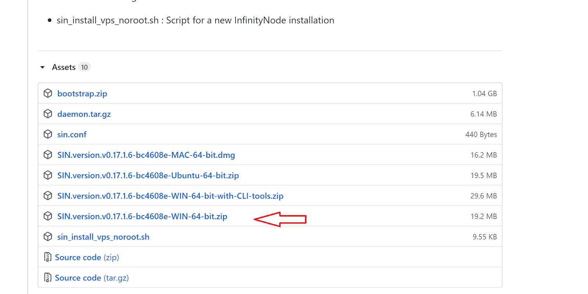

# Wallet Guides


# Windows QT Wallet Backup and Upgrade Guide

* First of all, don't forget to back up your current data.

* Close your wallet.

* Open the Run window using the WIN + R key combination.


* Enter the `%appdata%/SIN` command and click the OK button. Thus, you will reach the directory where your SIN data is kept.


 

Your wallet.dat file can be either in the wallets directory or in the SIN home directory, depending on the situation. Pay attention to this and back up these files to a suitable medium. We recommend that you do this periodically.

  


*Shut down the wallet. Backup wallet.dat and Remove all old files and folders. 


Download the latest version of Windows Wallet at [https://github.com/SINOVATEblockchain/SIN-core/releases](https://github.com/SINOVATEblockchain/SIN-core/releases)
 


  

Replace the `sin-qt.exe` file in the compressed file you downloaded with the `sin-qt.exe` file you are currently using.

*Start the new wallet and wait for synchronization.


**Resync Windows wallet**
In case you need to resync your local wallet in Windows:
* Close wallet;
* Create a shortcut;
* Rick click on shortcut and select properties;
* add in target, at the end of the path ` -reindex` (space -reindex, see screenshot below)
* wait full resync


Or use [Bootstrap](https://docs.sinovate.io/#/bootstrap)

# MAC QT Wallet Backup and Upgrade Guide

  

* First of all, don't forget to back up your current data.

* Close your wallet.

* In order to see hidden folders, such as `~/Library` from Finder, simply hit `shift + ⌘ (command) + G` which will GO to a folder, then paste in this location:


* ```~/Library/Application Support/SIN```


 

Your wallet.dat file can be either in the wallets directory or in the SIN home directory, depending on the situation. Pay attention to this and back up these files to a suitable medium. We recommend that you do this periodically.

  


*Shut down the wallet. Backup wallet.dat and Remove all old files and folders. 


Download the latest version of MAC Wallet at [https://github.com/SINOVATEblockchain/SIN-core/releases](https://github.com/SINOVATEblockchain/SIN-core/releases)
 


  

Replace the `sin-qt app` file in the compressed file you downloaded with the `sin-qt app` file you are currently using.

*Start the new wallet and wait for synchronization.


# VPS Infinity Node Update And Sync Guide

**disable it if you are using a crontab**
```bash
crontab -l > my_cron_backup.txt
crontab -r
```

**if running Infinity Node, stop it.**
```bash
sudo systemctl stop sinovate.service
./sin-cli stop
```

**update Latest Wallet** 
```bash
wget -O daemon.tar.gz https://github.com/SINOVATEblockchain/SIN-core/releases/latest/download/daemon.tar.gz

tar -xzvf daemon.tar.gz
```
**install unzip package**
```bash
sudo apt update && sudo apt install unzip
```
**remove old files and folders**
```bash
rm -rf ~/.sin/{blocks,chainstate,debug.log,mnpayments.dat,mncache.dat,banlist.dat,peers.dat,netfulfilled.dat,governance.dat,fee_estimates.dat}
```

**Run the daemon**
```bash
./sind
```
* :warning: **This place is important. Please wait 3-5 minutes. Then check the block height. If you get an error message that blocks are loading, wait a little longer.**
```bash
./sin-cli getblockcount
```
**When you see a block height above 3k, go to the next step**
**Infinity Node, stop it again**
```bash
./sin-cli stop
```
**download latest bootstrap archive**
```bash
wget -O ~/bootstrap.zip https://github.com/SINOVATEblockchain/SIN-core/releases/latest/download/bootstrap.zip
```
**remove old blocks and chainstate folders**
```bash
rm -rf ~/.sin/{blocks,chainstate}
```
**unzip the bootstrap archive**
```bash
unzip ~/bootstrap.zip
```
**move bootstrap files**
```bash
mv -t ~/.sin ~/bootstrap/blocks ~/bootstrap/chainstate
```
**Run the daemon again**
```bash
./sind
```

:warning: **please wait 3-5 minutes. Then check the block height. If you get an error message that blocks are loading or rescanning, wait a little longer.**
```bash
./sin-cli getblockcount 
```
**if everything is ok and you are using crontab, re-enable it.**
```bash
crontab my_cron_backup.txt
crontab -l
```
**remove unnecessary files**
```bash
rm -rf ~/{bootstrap,bootstrap.zip}
```
